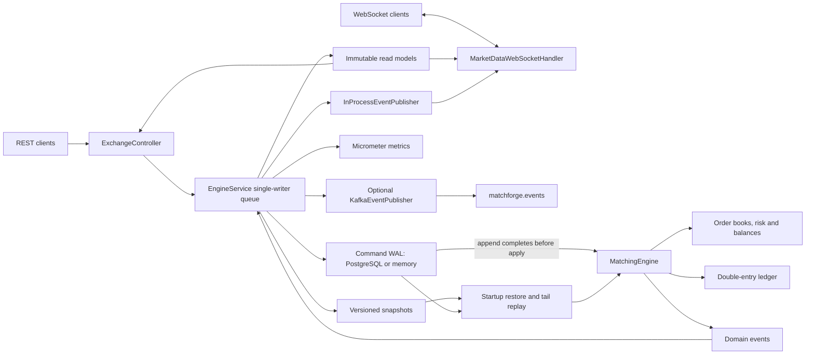

# Matchforge

A deterministic Java exchange core with price-time matching, reserved balances, a double-entry ledger, and PostgreSQL command recovery.

[](https://github.com/GuilhermeBars/matchforge/actions/workflows/ci.yml)
[](LICENSE)


## Why build an exchange core?

An exchange needs more than an order-matching loop. Better prices must execute
first, equal prices must respect arrival order, and funds committed to one order
must not be spent by another. Recovery must reproduce the same decisions, and
settlement must leave an auditable explanation of every balance change.

Matchforge explores those requirements in a single-instance portfolio project.
Its framework-free engine receives sequenced commands, checks funds before
mutation, matches at the resting order's price, and produces balanced ledger
postings. A PostgreSQL write-ahead command journal and snapshots reconstruct
state after restart. It is not a production exchange or a custody system.

## Features and stack

- LIMIT and MARKET orders with GTC, IOC and FOK behavior; partial fills,
  multi-level sweeps, cancellation and priority-aware replacement.
- Account balances split into available and reserved funds; tick/lot checks,
  market-buy quote budgets, and rejection of incoming self-trades.
- Account-scoped order idempotency, including original rejected outcomes.
- Double-entry settlement, deposit/withdrawal contra postings, and replayable
  command history. Fees are fixed at zero.
- PostgreSQL journal and checksummed, versioned snapshots; a volatile memory
  profile for local development.
- REST API, OpenAPI/Swagger UI, sequenced WebSocket depth/trade feeds,
  Prometheus metrics and optional Kafka publishing.
- Unit and property tests, Docker-gated integration tests, JMH benchmarks,
  a REST load CLI, Compose and GitHub Actions workflows.

Java 21, Spring Boot 3.5.13, Spring MVC/WebSocket/JDBC, PostgreSQL 16, Flyway,
Jackson, Spring Kafka, Micrometer/Prometheus and springdoc-openapi.
Gradle, JUnit 5, AssertJ, jqwik, Testcontainers, JaCoCo, JMH and Spotless provide
the build and verification tooling. There is no JPA or Disruptor dependency.

## Architecture



Order submission follows the actual implementation order: the idempotency
lookup is **inside the engine, after journal append**. Retries therefore consume
a journal sequence, but do not place another order or emit business events.

```mermaid
sequenceDiagram
    participant Client
    participant API as ExchangeController
    participant Writer as EngineService writer
    participant WAL as Journal
    participant Engine as MatchingEngine
    participant Pub as Local / Kafka publishers
    Client->>API: POST /api/v1/orders
    API->>API: Validate DTO and convert decimal strings
    API->>Writer: submit(command), await future
    Writer->>Writer: Assign sequence and timestamp
    Writer->>WAL: Append command
    WAL-->>Writer: Committed (Postgres) / stored (memory)
    Writer->>Engine: process(envelope)
    Engine->>Engine: Check (accountId, clientOrderId)
    alt Identical retry
        Engine-->>Writer: Original outcome, empty events
    else Key reused with different payload
        Engine-->>Writer: Conflict, empty events
    else New placement
        Engine->>Engine: Preflight risk, liquidity and self-trade
        Engine->>Engine: Reserve, match, settle; retain outcome
        Engine-->>Writer: Outcome and events (or rejection)
    end
    Writer->>Writer: Publish immutable view and record metrics
    Writer->>Pub: Publish event batch (possibly empty)
    Pub-->>Writer: Listeners return / Kafka sends acknowledged
    opt Snapshot interval reached
        Writer->>Writer: Save snapshot
    end
    Writer-->>API: Complete future
    API-->>Client: 201 new / 200 replay / problem response
```

See [architecture](docs/architecture.md) for failure boundaries, persistence
formats, recovery validation and transport details.

## Decisions and trade-offs

| Decision | Behavior and cost |
|---|---|
| Fixed-point `long` atoms | Matching and settlement use checked integer arithmetic, avoiding floating-point rounding. `BigDecimal` handles exact boundary conversion and displayed average prices; `BigInteger` handles ledger checks and average accumulation. Precision and range are finite; overflow is rejected. |
| One writer instead of book locks | A bounded executor serializes all commands and cross-asset settlement. The single-writer idea is in the spirit of LMAX, implemented here with a JDK executor, not its Disruptor. FIFO fairness follows writer admission order, not client wall clocks. Throughput is limited by one writer and its I/O. |
| Command sourcing | The WAL stores intent, sequence and timestamp; events and ledger are derived by deterministic replay. This avoids a second event/ledger database write, but historical commands require compatible matching semantics after upgrades. |
| Write ahead | PostgreSQL JDBC autocommit completes before engine application. “Durable” means the database acknowledged the insert commit, subject to its durability/storage settings; it does not mean Kafka or WebSocket delivery. Memory mode has no restart durability. |
| Snapshots | Every 1,000 submitted commands by default, including retries, plus an admin trigger. Restore the latest checksummed version-1 snapshot and replay its journal tail. There is no pruning or automatic migration framework. |
| Idempotency | `(accountId, clientOrderId)` retains the canonical placement payload and original result. Same payload returns that result; different payload returns 409. Replay/snapshots restore keys. Deposits, withdrawals, cancel and replace have no equivalent retry key. |
| Reservations | Buy limits reserve limit price × quantity; sells reserve base quantity. Market buys reserve their entire quote budget. Fills settle reserved funds; improvement, cancellation and expiry release unused funds. Withdrawals can use only available funds. |
| Self-trade | Reject the entire incoming order/replacement if its executable path would reach the same account's resting order. Preflight prevents earlier partial fills in that rejected command. |
| Replace priority | Same-price quantity decrease or equality keeps FIFO position. Price changes or quantity increases requeue and can immediately match. The order ID stays stable; quantity means **new remaining quantity**. Failed replacements preserve the original order. |
| Market protection | Buys require a positive `quoteBudget`, stop at its affordable whole-lot quantity and release unused budget. This is a spend cap, not a price/slippage limit. Market sells have no price floor. |
| Double-entry ledger | Each fill balances both assets. Deposits/withdrawals balance against reserved identifier `EXTERNAL`, a contra account that cannot be created as a customer. Reservation transfers do not change total holdings and create no ledger postings. |
| Local versus Kafka events | Local listeners run on the writer and enqueue socket work. Kafka mode also delivers locally, then waits for broker acknowledgements. A publication failure fences the writer after commit; recovery does not republish. Delivery across crashes is best effort, **not guaranteed at-least-once**. |
| WebSocket feed | Complete top-10 depth updates coalesce on a 75 ms ticker; trades use bounded FIFO delivery. Sequence numbers are per symbol per connection, shared across channels and reset on reconnect. Slow/overflowing clients are disconnected; there is no feed replay. |

## Matching rules

Orders execute at maker prices, best price first, FIFO within each price level.
All combinations below first pass validation, funding and self-trade checks.

| Type | Time in force | Behavior |
|---|---|---|
| LIMIT | GTC | Match at the limit or better; rest the remainder. |
| LIMIT | IOC | Match immediately at the limit or better; cancel the remainder (`IOC_REMAINDER`). |
| LIMIT | FOK | Fill the entire quantity immediately or cancel without fills (`FOK_KILLED`). |
| MARKET | GTC | Accepted; sweep available liquidity within the buy budget and cancel the remainder. Never rests. |
| MARKET | IOC | Same execution behavior as MARKET+GTC. Remainder reason is `MARKET_NO_LIQUIDITY` or `MARKET_BUDGET`. |
| MARKET | FOK | Fill completely within available liquidity and the buy budget, or cancel without fills (`FOK_KILLED`). |

A killed FOK leaves books, balances, ledger and trade IDs unchanged. It still
consumes a command sequence and order ID and retains its idempotency outcome.
`CANCELLED` can include partial fills for IOC/market orders. Validation failures
are distinct from an otherwise valid order that cannot fill.

## Getting started

### Docker Compose

With Docker and Compose available:

```sh
docker compose up --build --detach --wait --wait-timeout 180
curl http://localhost:8080/actuator/health
docker compose down
```

Compose runs PostgreSQL and the app; the named database volume survives `down`.
The bundled database password is a local development default. The API has no
authentication, including funding and admin routes; keep this setup private.
See [containers and CI](docs/containers.md) for deployment details.

### Local, without Docker

Install JDK 21 and set `JAVA_HOME`; the wrapper downloads Gradle, but Java
toolchain auto-download is disabled.

```sh
./gradlew bootRun --args='--spring.profiles.active=memory'
```

On Windows:

```powershell
.\gradlew.bat --no-daemon bootRun --args='--spring.profiles.active=memory'
```

The app listens on **http://localhost:8080**. Memory mode requires no database
or broker and loses all state on exit. Stop it with Ctrl+C. The `local` profile
includes `memory`. Setting only `JOURNAL_TYPE=memory` does not disable database
autoconfiguration; use the profile for database-free startup.

- [Swagger UI](http://localhost:8080/swagger-ui.html)
- [OpenAPI JSON](http://localhost:8080/v3/api-docs)
- [Health](http://localhost:8080/actuator/health)
- [Prometheus](http://localhost:8080/actuator/prometheus)

### Configuration

| Property | Environment override | Default / meaning |
|---|---|---|
| `server.port` | `SERVER_PORT` | `8080` |
| `spring.datasource.url` | `DB_URL` | `jdbc:postgresql://localhost:5432/matchforge` |
| `spring.datasource.username` | `DB_USERNAME` | `matchforge` |
| `spring.datasource.password` | `DB_PASSWORD` | `matchforge` (local development) |
| `matchforge.journal.type` | `JOURNAL_TYPE` | `postgres`; memory profile selects `memory` |
| `matchforge.events.publisher` | `EVENTS_PUBLISHER` | `in-process`; optional `kafka` |
| `matchforge.engine.queue-capacity` | `ENGINE_QUEUE_CAPACITY` | `1024` pending commands; full queue returns 503 |
| `matchforge.snapshot.interval` | `SNAPSHOT_INTERVAL` | `1000`, positive command interval |
| `spring.kafka.bootstrap-servers` | `SPRING_KAFKA_BOOTSTRAP_SERVERS` | Adapter fallback `localhost:9092`; Compose uses `redpanda:9092` |
| `matchforge.instruments` | Configure list in YAML | BTC-USD and ETH-USD; price scale 2, quantity scale 8, tick `0.01`, lot `0.00000001` |

Quote settlement scale is price scale + quantity scale, so USD balances/budgets
use scale 10 in the default markets. Shared assets must have consistent scales.
The memory profile explicitly selects in-process publishing; use a command-line
property to override it when experimenting with Kafka.

### Optional Kafka profile

`kafka` is a **Compose profile**, not a Spring application profile. Start the
broker first, then select the publisher (POSIX shell):

```sh
docker compose --profile kafka up --detach --wait --wait-timeout 180 redpanda
EVENTS_PUBLISHER=kafka docker compose --profile kafka up --build --detach --wait --wait-timeout 180
docker compose --profile kafka down
```

PowerShell environment syntax and teardown are in [containers](docs/containers.md).
The topic is `matchforge.events`; selecting the Compose profile alone does not
enable publishing. Producer idempotence and `acks=all` do not provide a durable
application outbox or replay of missed events.

## API walkthrough

These responses were captured on 2026-09-30 from a fresh memory-profile app on
port 8080 using curl. Run the requests in order; timestamps will differ and IDs
assume empty state. Commands below use POSIX shell quoting. In Windows
PowerShell, use `curl.exe` and JSON request files with `--data-binary @file.json`
to avoid native-command quoting differences.

All monetary values, prices and quantities are **JSON strings**, including
signed ledger amounts. Numeric tokens, exponents, precision loss and overflow
are rejected. IDs and enums are case-sensitive.

### Create and fund two accounts

```sh
curl -sS -H 'Content-Type: application/json' -d '{"id":"seller"}' http://localhost:8080/api/v1/accounts
curl -sS -H 'Content-Type: application/json' -d '{"id":"buyer"}' http://localhost:8080/api/v1/accounts
curl -sS -H 'Content-Type: application/json' -d '{"asset":"BTC","amount":"2"}' http://localhost:8080/api/v1/accounts/seller/deposits
curl -sS -H 'Content-Type: application/json' -d '{"asset":"USD","amount":"1000"}' http://localhost:8080/api/v1/accounts/buyer/deposits
```

Account creation returns 201; funding returns 200. Buyer responses:

```json
{"id":"buyer","balances":[]}
```

```json
{"id":"buyer","balances":[{"asset":"USD","available":"1000.0000000000","reserved":"0.0000000000"}]}
```

### Rest a sell, then cross it

```sh
curl -sS -H 'Content-Type: application/json' -d '{"accountId":"seller","clientOrderId":"sell-1","symbol":"BTC-USD","side":"SELL","type":"LIMIT","timeInForce":"GTC","price":"100.00","quantity":"1"}' http://localhost:8080/api/v1/orders
```

201, `Idempotent-Replay: false`:

```json
{"orderId":"1","accountId":"seller","clientOrderId":"sell-1","symbol":"BTC-USD","status":"NEW","remainingQuantity":"1.00000000","filledQuantity":"0.00000000","averagePrice":null,"fills":[],"reason":null}
```

```sh
curl -sS -H 'Content-Type: application/json' -d '{"accountId":"buyer","clientOrderId":"buy-1","symbol":"BTC-USD","side":"BUY","type":"LIMIT","timeInForce":"GTC","price":"110.00","quantity":"0.4"}' http://localhost:8080/api/v1/orders
```

201; the trade executes at the resting price, releasing the buyer's improvement:

```json
{"orderId":"2","accountId":"buyer","clientOrderId":"buy-1","symbol":"BTC-USD","status":"FILLED","remainingQuantity":"0.00000000","filledQuantity":"0.40000000","averagePrice":"100.00","fills":[{"tradeId":1,"symbol":"BTC-USD","makerOrderId":"1","takerOrderId":"2","price":"100.00","quantity":"0.40000000","timestamp":"2026-09-30T15:53:08.846711Z"}],"reason":null}
```

Repeat the identical sell request with `curl -i`: it returns **200**,
`Idempotent-Replay: true`, and the original `NEW` body above. To obtain current
status, use `GET /api/v1/orders/1`, which now reports `PARTIALLY_FILLED`.

```sh
curl -sS http://localhost:8080/api/v1/accounts/buyer
curl -sS 'http://localhost:8080/api/v1/markets/BTC-USD/book?depth=10'
```

200 responses, after that retry:

```json
{"id":"buyer","balances":[{"asset":"USD","available":"960.0000000000","reserved":"0.0000000000"},{"asset":"BTC","available":"0.40000000","reserved":"0.00000000"}]}
```

```json
{"symbol":"BTC-USD","sequence":7,"bids":[],"asks":[{"price":"100.00","quantity":"0.60000000","orderCount":1}]}
```

Reusing `sell-1` with a changed quantity returns 409:

```sh
curl -sS -H 'Content-Type: application/json' -d '{"accountId":"seller","clientOrderId":"sell-1","symbol":"BTC-USD","side":"SELL","type":"LIMIT","timeInForce":"GTC","price":"100.00","quantity":"2"}' http://localhost:8080/api/v1/orders
```

```json
{"type":"urn:matchforge:problem:duplicate_client_order_id","title":"Conflict","status":409,"detail":"DUPLICATE CLIENT ORDER ID","instance":"/api/v1/orders","code":"DUPLICATE_CLIENT_ORDER_ID","order":{"orderId":"1","accountId":"seller","clientOrderId":"sell-1","symbol":"BTC-USD","status":"REJECTED","remainingQuantity":"0.00000000","filledQuantity":"0.00000000","averagePrice":null,"fills":[],"reason":"DUPLICATE_CLIENT_ORDER_ID"}}
```

### A market buy with a spend cap

```sh
curl -sS -H 'Content-Type: application/json' -d '{"accountId":"buyer","clientOrderId":"market-1","symbol":"BTC-USD","side":"BUY","type":"MARKET","timeInForce":"IOC","quantity":"0.2","quoteBudget":"10"}' http://localhost:8080/api/v1/orders
```

201; the budget buys only part of the requested quantity:

```json
{"orderId":"3","accountId":"buyer","clientOrderId":"market-1","symbol":"BTC-USD","status":"CANCELLED","remainingQuantity":"0.10000000","filledQuantity":"0.10000000","averagePrice":"100.00","fills":[{"tradeId":2,"symbol":"BTC-USD","makerOrderId":"1","takerOrderId":"3","price":"100.00","quantity":"0.10000000","timestamp":"2026-09-30T15:53:09.097877Z"}],"reason":"MARKET_BUDGET"}
```

### Replace, cancel, withdraw and inspect

```sh
curl -sS -X PUT -H 'Content-Type: application/json' -d '{"price":"101.00","quantity":"0.25"}' http://localhost:8080/api/v1/orders/1
curl -sS -X DELETE http://localhost:8080/api/v1/orders/1
curl -sS -H 'Content-Type: application/json' -d '{"asset":"USD","amount":"10"}' http://localhost:8080/api/v1/accounts/buyer/withdrawals
curl -sS 'http://localhost:8080/api/v1/accounts/seller/orders?status=OPEN'
curl -sS 'http://localhost:8080/api/v1/markets/BTC-USD/trades?limit=50'
curl -sS http://localhost:8080/api/v1/ledger/accounts/buyer/entries
curl -sS http://localhost:8080/api/v1/markets
curl -sS -X POST http://localhost:8080/api/v1/admin/snapshots
```

Replacement keeps order ID `1` and sets the remaining quantity to `0.25000000`;
cancellation returns `CANCELLED` with reason `USER` and retains prior fills.
The open-order list is then `[]`. The snapshot response for this sequence is:

```json
{"sequence":12}
```

Book depth accepts 1–100; recent trades accept a limit of 1–1,000 and return
newest first, from the latest 1,000 trades retained globally. Account order
filters accept `OPEN`, `NEW`, `PARTIALLY_FILLED`, `FILLED`, `CANCELLED`, `REJECTED`.
Ledger entries contain `sequence`, `timestamp`, `reference`, `asset`, `amount`.
Errors use ProblemDetail with a stable `code`: validation 400, missing entities
404, conflicts 409, insufficient funds/self-trade 422, writer unavailability 503.

### WebSocket message flow

Connect to `ws://localhost:8080/ws/market-data`. This captured flow subscribed
after funding, before placing the sell/buy pair above:

```json
{"op":"subscribe","channel":"trades","symbol":"BTC-USD"}
```

Even a trades subscription first receives a book snapshot:

```json
{"data":{"symbol":"BTC-USD","sequence":4,"bids":[],"asks":[]},"type":"snapshot","sequence":1,"symbol":"BTC-USD","channel":"book"}
```

After the first fill:

```json
{"data":{"tradeId":1,"symbol":"BTC-USD","makerOrderId":"1","takerOrderId":"2","price":"100.00","quantity":"0.40000000","timestamp":"2026-09-30T15:53:08.846711Z"},"type":"trade","sequence":2,"symbol":"BTC-USD","channel":"trades"}
```

Subscribe separately with `"channel":"book"` for coalesced `"type":"update"`
messages containing complete depth snapshots. Use `"op":"unsubscribe"` with
the same channel and symbol to stop that subscription. Outer `sequence` tracks
transport messages; `data.sequence` in a book is the command sequence. They are
not interchangeable. On a gap or disconnect, reconnect and resubscribe; there
is no historical trade backfill through WebSocket. A queue overflow or slow
send closes the connection instead of silently dropping trades.

## Testing

```sh
./gradlew --no-daemon build
./gradlew --no-daemon test --rerun-tasks
./gradlew --no-daemon spotlessApply
```

`build` runs tests and Spotless checks and compiles JMH/load-test sources; it does
not execute the benchmarks. Use `gradlew.bat` on Windows.

| Category | What is checked |
|---|---|
| Unit and service | Fixed-point boundaries, FIFO and maker pricing, risk, FOK atomicity, replace priority, reservations, ledger balance, idempotency, failure fencing and backpressure. |
| jqwik properties | Decimal conversion and multiplication; random commands check nonnegative balances, conservation, uncrossed books, exact reservations, deterministic events, full replay and snapshot-tail recovery. |
| REST and WebSocket | MockMvc request/response validation and status codes; a real random-port WebSocket client checks snapshots, trades, coalesced depth and unsubscribe. These run without Docker. |
| Testcontainers | PostgreSQL journal contracts, exclusive writer, checksums, snapshot-tail REST recovery, and publication to a real Kafka broker. |

Results on 2026-09-30: **123 tests** (five of them jqwik properties; generated
trials are not counted as separate tests). In GitHub Actions, where Docker is
available, all 123 ran with **0 skipped, 0 failures**, and JaCoCo reported
**92.5% line / 78.0% branch coverage**. Locally without Docker, the six
Docker-dependent tests (four in `PostgresPersistenceTest`, one in
`PostgresRestRecoveryTest`, one in `KafkaContainerTest`) skip automatically, so
117 pass and 6 are skipped. The CI job summary publishes the coverage counters.

Reports: `build/reports/tests/test/index.html`,
`build/reports/jacoco/test/html/index.html`, and
`build/reports/jacoco/test/jacocoTestReport.xml`.

## Benchmarks

Only the measurements recorded in [docs/benchmarks.md](docs/benchmarks.md) are
quoted here. Its 2026-09-30 JMH run reported:

| Benchmark | Mean throughput | JMH error (99.9%, ±) |
|---|---:|---:|
| `EngineBenchmark.mixedOrderFlow` | 1045704.797 commands/s | 94278.623 commands/s |
| `JournalBenchmark.serializeCommand` | 1505266.658 payloads/s | 1396313.017 payloads/s |

Machine: Intel Core i5-10400 @ 2.90 GHz, 12 logical processors, 31.882 GiB RAM,
Windows 10 10.0 amd64, Eclipse Adoptium Temurin 21.0.12.1+1-LTS. The run used
JMH 1.36, one fork/thread, two 1-second warmups, three 1-second measurements and
a 256 MiB heap. The engine benchmark uses bounded synthetic batches and excludes
REST, writer queues, read-model publication, snapshots and durable I/O.
Serialization measures JSON encoding, not database commits. These short-run
results do not establish production capacity; the serialization interval is
particularly wide. See the linked document for workload definitions, raw-result
location, caveats and REST load-generator instructions.

## Project structure

```text
src/main/java/io/github/guilhermebars/matchforge/
  api/          REST DTOs, mapping and error responses
  config/       Spring wiring and instrument configuration
  domain/       Identifiers, fixed-point values and instruments
  engine/       Matching, books, commands, events and engine snapshots
  events/       In-process and Kafka publishers
  idempotency/  Package documentation; implementation lives in MatchingEngine
  journal/      Command codecs, journals and snapshot stores
  ledger/       Balanced postings and reconciliation
  risk/         Account balances and pre-trade validation
  service/      Single writer, recovery, read models and metrics
  ws/           Market-data subscriptions and bounded send queues
src/main/resources/
  application*.yml
  db/migration/ Flyway schema history
src/test/java/  Unit, property, REST, WebSocket and container tests
src/jmh/java/   Engine and serialization microbenchmarks
src/loadtest/   REST load CLI
docs/          Architecture, benchmarks, containers and CI
.github/workflows/ci.yml
Dockerfile
docker-compose.yml
```

## Limitations and roadmap

- No authentication, authorization, real deposits/withdrawals, custody or
  production security controls. Funding calls directly change simulated holdings.
- One instance and one writer across all markets. PostgreSQL advisory locking
  rejects another journal writer; there is no HA failover or symbol sharding.
- Books are bounded by available RAM. Ledger, order and idempotency history grow
  without retention limits; immutable views copy retained state per command.
  Journal entries and PostgreSQL snapshots are not pruned.
- Snapshots **are versioned**, but there is no general schema migration tool or
  historical rule-version dispatcher. Incompatible/corrupt latest snapshots fail
  startup rather than automatically falling back to an older one.
- Kafka publication follows commit and can be incomplete across crashes; no
  durable outbox, publication cursor or consumer deduplication is provided.
  WebSocket delivery has no replay or guaranteed continuity across reconnects.
- Deposits/withdrawals are not idempotent. A failed response after commit does not
  imply rollback. Reads can observe applied state before publication completes.
- Market-buy budgets limit spend, not slippage; market sells have no price floor.
  Fees are zero, and there are no stop, iceberg or auction orders.
- Shutdown drains accepted work; JDBC and custom listener timeouts need explicit
  operational configuration. Actuator health has no custom writer-failure probe.

Possible next steps: durable event outbox and consumer deduplication; bounded
history and incremental read models; persistence/rule migrations; authentication
and funding idempotency; explicit slippage controls; coordinated account risk for
symbol sharding and failover. These are future work, not existing capabilities.

## Contributing and license

See [CONTRIBUTING.md](CONTRIBUTING.md). Licensed under [MIT](LICENSE).

Built by **Guilherme Bars**.
