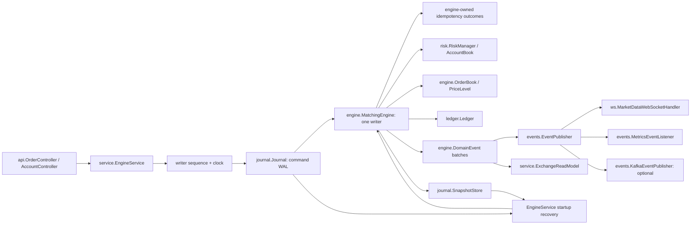

# Matchforge architecture

Sessions 1–3 deliver the framework-free matching/risk/ledger core, command WAL,
Postgres and memory persistence, checksummed snapshots, recovery, a bounded
single-writer service, immutable read models, event publishers and metrics.
REST and WebSocket endpoints remain for subsequent sessions.

## Boundaries and concurrency

All packages live under `io.github.guilhermebars.matchforge`. `domain`, `engine`,
`risk`, `ledger` core and `idempotency` core have no Spring dependency.
`MatchforgeApplication`, `config.MatchforgeProperties` and adapter configurations
own framework wiring. REST DTOs do not enter the engine directly.

`EngineService` owns a bounded single-thread executor and returns one
`CompletableFuture<CommandResult>` per submission. `matchforge.engine.queue-capacity`
(default 1024) bounds pending work, excluding the one running command. A full or
closed queue fails the future with `UnavailableException`, annotated for HTTP 503;
the future REST adapter must unwrap asynchronous failures. The writer assigns the
contiguous sequence and UTC timestamp (microsecond precision for PostgreSQL) before
persistence. Account IDs are caller-supplied; monotonic order/trade counters live in
engine snapshots. Admission resumes only after synchronous startup recovery.

`MatchingEngine.process(CommandEnvelope)` receives sealed command records
`PlaceOrder`, `CancelOrder`, `ReplaceOrder`, `CreateAccount`, `Deposit`, and
`Withdraw`. It returns an immutable `CommandResult` and ordered `DomainEvent`
batch; it never reads a clock, generates random IDs or performs I/O.

`OrderBook` stores bids descending and asks ascending in `TreeMap<Long, PriceLevel>`.
`PriceLevel` uses an insertion-ordered `LinkedHashMap<OrderId, OpenOrder>` as its
FIFO queue; replacing a value preserves its position. A per-book `OrderId` index
locates the level for O(1) queue removal (level lookup/removal costs O(log levels)).
Cancel/replace currently locates the symbol across the configured books; this is
O(number of symbols), followed by indexed removal. `ReplaceOrder` keeps priority for a
quantity decrease at the same price; a price change or increase loses priority.
IOC and market remainders expire. FOK preflights liquidity, risk and self-trade
constraints before any mutation. Self-trade policy is **reject newest**: preflight
rejects the entire incoming command if its executable path would hit its own
resting order, preventing partial side effects before rejection.

Replace quantity means **new remaining quantity**, and the order ID stays stable.
A requeued replacement emits `OrderCancelled(REPLACED)` and `OrderReplaced`, then
any trades/resting event. Same-price equal quantity also retains priority. A failed
replace leaves the original order and reservation intact. FOK kill changes no
books, balances, ledger or trade IDs; command sequence, an allocated cancelled
order ID and its idempotency outcome are still recorded. Events carry the caller's
sequence/timestamp; trades additionally have a globally increasing trade ID.

Reads use atomically published immutable `ExchangeReadModel` views, or queue a
read on the engine thread. They never traverse mutable books from HTTP threads.
The single writer simplifies deterministic replay and cross-asset settlement but
limits throughput to one core. Symbol sharding is a roadmap item requiring a
coordinated account reservation design. Shutdown stops admission, drains accepted
commands, then closes publishers, the executor and database resources.

## Fixed point and risk

`Price(long units, int scale)` and `Quantity(long units, int scale)` accept scales
0..18, parse unsigned plain decimal strings exactly, and format without exponents.
Scale is part of identity; arithmetic/comparison requires canonical scales.
Zero represents empty balances/remainders; `InstrumentConfig` rejects zero order
price/quantity and enforces exact tick/lot multiples and configured scales.
Identifiers preserve case and reject whitespace. Assets/symbols are uppercase;
account, order and client order IDs allow 1..128 ASCII identifier characters.

`Price.multiply(Quantity, resultScale)` uses `Math.multiplyExact` before exact
rescaling; overflow (even an intermediate product) and fractional output atoms
are rejected, never silently rounded. Engine command amounts are canonical long
atoms: base settlement scale equals quantity scale, quote settlement scale equals
price scale + quantity scale. Thus notional is `Math.multiplyExact(price, qty)`.
The current instruments use price scale 2, base scale 8 and USD scale 10. The engine
constructor enforces one consistent scale per shared asset and a maximum scale of
18; incompatible market configurations fail immediately. Total customer holdings
per asset are capped at `Long.MAX_VALUE`: deposits preflight this bound, ensuring
all subsequent transfers and reservation releases can be represented without
overflow. Bounds checks precede state mutation.

`AccountBook` owns available/reserved amounts per `(AccountId, Asset)`.
`RiskManager` checks known instruments, positive tick/lot-compliant sizes and
sufficient funds. Buy limits reserve limit price times quantity in quote atoms;
sells reserve base quantity. Market buys require an explicit positive quote
budget (in quote settlement atoms), reserve that entire budget, and stop before
exceeding it. A budget above available funds is rejected. Affordable quantity is
rounded down to whole lots; market remainders never rest. On fills, reservations settle to the
counterparty; buy price improvement is released immediately. Cancel/expiry
releases the remaining reservation. Replace preflights its complete reservation
delta before modifying the existing order. Fees default to zero; later fee
support must include fees in reservations and credit a `FEES` house account.

## WAL, snapshots and recovery

The source of truth is **commands**, not derived events. Each `JournalEntry` stores
seq, timestamp, stable command type and JSON command payload. `PersistenceCodec`
uses Jackson mixins with six explicit names (`place-order.v1`, `deposit.v1`, etc.);
Java class/package names never enter the wire protocol and the engine stays
framework-free. Unknown names, incompatible snapshots or gaps fail recovery.
Commands replay business rejections as well as successful mutations.

This avoids persisting both commands and effects and retains the original intent
for audit. The trade-off is that replay depends on historical matching semantics:
future rule changes need an explicit command/state version migration or compatible
versioned handlers. Event sourcing would decouple replay from matching rules but
requires a separate complete event-application model. Neither event history nor
exactly-once external delivery is claimed here.

`Journal.append(entry)` returns its committed sequence. Entries start at 1 and are
contiguous; `readFrom(seq)` is inclusive, `readAfter(seq)` is exclusive, and
`lastSeq()` aliases `lastSequence()`. `InMemoryJournal` is volatile and synchronized.
`PostgresJournal` commits each JSONB insert with JDBC autocommit before engine apply;
sequence allocation remains on the writer. JdbcClient recovery reads use indexed,
ordered batches of 1000 rows. The adapter holds a session advisory lock on a
dedicated connection for its entire lifetime (including recovery), and uses that
same connection for append. Losing the connection therefore prevents unfenced
writes. Only one writer per database is supported; external SQL writes bypass
this contract. The pool needs at least two connections for the lease and reads.

The pipeline is: assign sequence/time, encode, durable append, apply, publish
immutable views, record metrics, publish events, periodically save a snapshot,
complete the future. Any unexpected pipeline failure fences admission and fails
queued futures; an uncertain append is never retried in the same process. There
is no rollback of committed effects. Restart replays the committed command; an
order retry returns its original outcome. Recovery does not publish historical
events or increment business counters. Business rejections do not fence the writer.

`SnapshotStore` has memory and Postgres implementations. `snapshot()` queues an
on-demand capture on the writer; periodic capture occurs every
`matchforge.snapshot.interval` commands, including no-op retries. Stored snapshots
include schema version, journal sequence, engine state, order status/fill history,
and the latest 1000 trades. SHA-256 covers canonical reserialization of the typed
state, so PostgreSQL JSONB key reordering does not invalidate the checksum. Recovery
checks checksum, row/state sequence, configured instruments and journal boundary,
then uses `MatchingEngine.restore` to check financial/book invariants and applies
the tail. Snapshots are stored atomically by one SQL upsert. Checksums detect
accidental corruption, not adversarial rewriting. No journal pruning is enabled.

`EngineSnapshot` includes balances, open orders in side/price/FIFO order, complete
ledger, order/trade counters and original idempotency request/outcome pairs.
`ExchangeReadModel` atomically publishes deeply immutable engine state, book depth,
current order outcomes and recent trades. Maker fills update their order status;
original submission outcomes remain separately retained for idempotency. Capturing
these copies per command is intentionally simple but costs time proportional to
retained history. Ledger, order and idempotency history are currently unbounded;
compaction and structural sharing need an explicit future policy.

Shutdown closes admission and drains accepted commands. Spring then closes
publishers, producer factories and the journal lease through bean dependency order.
Standalone callers own adapters and must close them after closing EngineService.
Shutdown waits for accepted work: production listeners must not block indefinitely,
and database/network timeouts should be set for the deployment.

## Idempotency, settlement and delivery

`MatchingEngine` keys placement by `(AccountId, ClientOrderId)`, stores the complete
immutable `PlaceOrder` payload and original `CommandResult.Outcome` (including
original fills). Identical retries return that outcome with `duplicate=true` and
an empty event batch; different payloads return distinct `CONFLICT` status and
`DUPLICATE_CLIENT_ORDER_ID` reason for a future HTTP 409 mapping. Every submitted
envelope still consumes its contiguous command sequence. Lookup/insertion occur
on the writer. Replay and snapshots restore outcomes, including rejections;
transport timeouts must not cause a second order.

`Ledger` creates immutable signed `Posting` records in balanced `Transaction`s: debit buyer
quote / credit seller quote, debit seller base / credit buyer base. Each trade's
postings sum to zero per asset. Deposits and withdrawals use an external clearing
account so all ledger transactions balance; customer plus house balances equal
net external funding. The ledger read model is derived **in memory** from the same deterministic command
application, retained in snapshots and exposed through
`readModel().engineState().ledger()`. There is no second PostgreSQL projection or
dual-write failure window. V2 removes the unused V1 `ledger_entry` table. Balanced
transactions are checked by the `Ledger.Transaction` constructor and conservation
is checked during recovery and engine/property tests. A SQL cross-row constraint
is unnecessary for this selected storage model.

`EXTERNAL` is reserved and cannot be created as a customer. Reserve/release only
moves holdings between available and reserved; it creates no settlement posting.
Deposits, withdrawals and every individual fill emit `LedgerPosted` with balanced
postings. Fees are fixed at zero in this session. `Ledger.trialBalance` uses
`BigInteger` for safe accumulation across arbitrarily long histories;
`assertConservation` reconciles ledger holdings with every account/asset.
`MatchingEngine.assertInvariants` additionally checks reservations against open
orders, book crossing, order validity, IDs and the aggregate holdings bound.

`InProcessEventPublisher` defaults to a removable, thread-safe listener registry.
Each immutable batch is delivered synchronously in registration order. All listeners
are attempted even if one fails; failure then fences EngineService. Future WebSocket
listeners must enqueue onto bounded subscriber queues rather than block the writer.
No WebSocket endpoint is implemented in this session.

`matchforge.events.publisher=kafka` conditionally creates the producer factory,
KafkaTemplate and `KafkaEventPublisher`. Kafka autoconfiguration is excluded in
both normal and memory profiles; the default creates no Kafka producer beans.
The adapter sends versioned JSON events to `matchforge.events`, keyed by symbol for
trades/resting orders and account for other events (cancel/replace use command
context). Explicit event names are stable across Java refactors. Sends await broker
acks with producer idempotence, `acks=all`, a 5-second metadata bound and a 30-second
delivery timeout. Partial publication/crash can leave a gap; recovery intentionally
does not resend events. A durable cursor/outbox and consumer deduplication remain
future work, so this is best-effort publication across crashes, not a durable
at-least-once or exactly-once delivery guarantee.

Micrometer records `matchforge.commands.processed` and `matchforge.journal.append`
timers; `matchforge.orders.accepted`/`rejected` counters with reason, trade/cancel
counters, per-symbol/side depth-level gauges, and a committed journal-sequence gauge.
Metrics are recorded directly in the service so Kafka mode retains the same metrics.
Duplicate retries emit no business counters; their command/journal timers still run.

## Configuration, verification and limitations

Default configuration targets PostgreSQL on localhost:5432; `DB_URL`,
`DB_USERNAME`, `DB_PASSWORD`, `JOURNAL_TYPE`, `EVENTS_PUBLISHER` and
`SNAPSHOT_INTERVAL` override the defaults. `--spring.profiles.active=memory`
excludes DataSource and Flyway autoconfiguration and wires `InMemoryJournal`.
`local` includes `memory`; neither requires Docker. All local state is lost on exit.
Setting only `JOURNAL_TYPE=memory` does not disable database autoconfiguration;
use the profile for database-free startup. Port is 8080.

Run `./gradlew --no-daemon build` (`.\gradlew.bat --no-daemon build` on Windows).
Java 21 must already exist; toolchain auto-download is disabled. JUnit Jupiter and
jqwik both run, and test finalizes XML/HTML JaCoCo reporting. JMH sources belong
in `src/jmh/java`; no engine performance results exist yet. Later integration
tests must use `@Testcontainers(disabledWithoutDocker = true)` locally and run
with Docker in CI. Engine JUnit tests cover matching, risk, FIFO/replacements,
atomic FOK/self-trade rejection, settlement, idempotency and JSON snapshots.
Two jqwik properties each run 60 generated sequences of 30–100 actions across two
symbols and three funded accounts, checking invariants after each command and
identical replay/snapshot continuation. Session 3 adds pipeline recovery, checksum,
idempotency, backpressure and failure-path tests. A 50-try jqwik journal property
compares full replay and snapshot-tail recovery. Postgres 16 Testcontainers tests
cover append/read, writer fencing, durable recovery and checksum tampering; they
skip without Docker. Kafka routing/failure tests use a mocked broker client.
REST and WebSocket integration tests belong to later sessions.

Authentication is out of scope: requests will carry account IDs, so the planned
API must not be exposed as a production exchange. The core is implemented;
the REST API, WebSocket feed and durable external delivery remain for later sessions.
Core reads and snapshots must run on the owning writer thread; callers read the
service's immutable published views.

