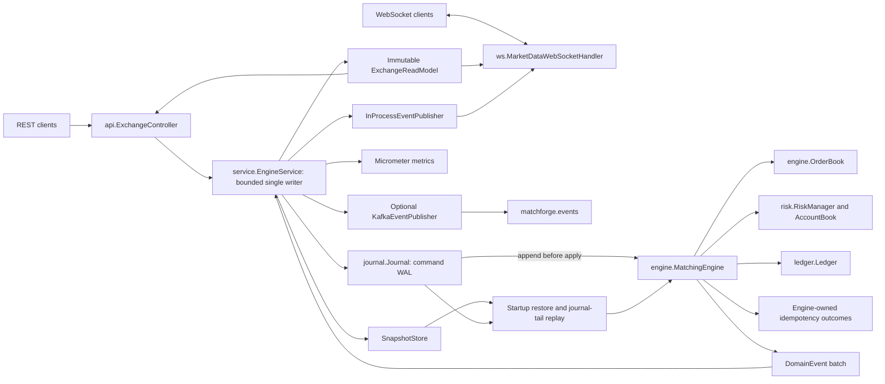

# Matchforge architecture

Matchforge is a single-instance exchange core with command sourcing, an
in-memory matching engine and PostgreSQL recovery. This document describes the
implemented boundaries and failure semantics. The [README](../README.md) covers
startup, matching rules and captured API examples.

## Components

All packages are under `io.github.guilhermebars.matchforge`. Domain, engine,
risk and ledger code has no Spring dependency. The `idempotency` package
documents a concern implemented within `MatchingEngine`, not a separate
service. Spring configuration owns adapters. REST DTOs are validated and
converted into domain commands at the HTTP boundary.

## Command pipeline and concurrency

`EngineService` owns a one-thread `ThreadPoolExecutor` with an
`ArrayBlockingQueue`. Capacity defaults to 1,024 pending tasks, excluding the
running task. Full/closed admission produces `UnavailableException`, mapped to
HTTP 503. Each submission returns a `CompletableFuture`, which the controller
joins. Snapshots share the writer.

The live pipeline is:

1. Assign the next contiguous sequence and UTC timestamp, truncated to
   microseconds for PostgreSQL.
2. Encode and append the command to the journal.
3. Apply it through `MatchingEngine.process`, including the idempotency check.
4. Project current orders/recent trades and publish an immutable view.
5. Record business metrics and publish the event batch.
6. Save a snapshot if the sequence reaches the configured interval.
7. Complete the future and construct the HTTP response.

Idempotency is checked **after append**, on the writer. Identical retries and
conflicts still consume sequences. HTTP validation failures before submission
do not enter the journal.

The engine receives `CommandEnvelope(sequence, timestamp, command)` and returns
immutable outcomes/events. It reads no clock, performs no I/O and generates no
random IDs. Order/trade counters belong to engine state. Account IDs are supplied
in commands; the HTTP boundary generates a UUID when creation omits an ID.
Determinism assumes the same envelopes, configuration and matching implementation,
not concurrent HTTP arrival timing.

One writer avoids interleaved book/risk/settlement mutations. The idea is in the
spirit of LMAX, but implemented with a JDK executor, not Disruptor. It limits
parallelism and includes journal, publisher and snapshot work in command latency.
Sharding would also require coordinated account reservations across markets.

Reads use the atomically published `ExchangeReadModel`, never mutable books
from HTTP threads. It contains copied engine state, full aggregated depth,
current orders and the latest 1,000 trades globally. The core is not thread-safe;
direct access belongs to its owning thread. Maker fills update current order
outcomes; original placement outcomes remain separate for idempotency.
View publication precedes events and response completion, so reads can observe
effects before their request finishes. Copies of ledger, order and idempotency
history grow with retained state; only the recent-trade deque is history-bounded.

## Matching and risk

Each symbol has descending bid and ascending ask `TreeMap`s. Each price level
uses a FIFO `LinkedHashMap<OrderId, OpenOrder>`. An order index supports direct
lookup and constant-time removal within a level; level lookup/removal costs
O(log price levels). Cancel/replace scans books to locate the symbol,
O(number of symbols).

Execution uses the resting price, best price first and FIFO at that price.
LIMIT+GTC may rest; LIMIT+IOC cancels its remainder. MARKET+GTC and MARKET+IOC
are both accepted and never rest. FOK preflights the full executable quantity
and kills an incomplete plan before balances, books or ledger change. A killed
FOK still allocates an order ID, advances sequence and retains an outcome.

Self-trade policy is **reject incoming/newest**. If the executable path reaches
an order from the same account, the entire placement/replacement is rejected
before any earlier external fill is applied. Orders outside the limit or
unaffordable under a buy budget are not executable self-trades.

Replacement quantity means **new remaining quantity**. Same-price decrease or
equality keeps FIFO position; price changes or increases requeue and can match
immediately. The ID stays stable. Requeue emits `OrderCancelled(REPLACED)`,
`OrderReplaced`, then any fills/resting event. Failed preflight preserves the
existing order and reservation. REST fills include those preceding replacement.

`AccountBook` holds available/reserved balances. `RiskManager` validates
instruments, positive tick/lot multiples and order fields; `MatchingEngine`
checks funding against the calculated reservation. Buy limits
reserve limit price × quantity in quote atoms; sells reserve base quantity.
Market buys reserve their entire positive quote budget, rejecting budgets above
available funds even if current liquidity would cost less. Affordable quantity
rounds down to whole lots. A budget caps spend, not execution price; market sells
have no price floor.

Fills transfer reserved funds to counterparties, immediately release buy-limit
price improvement, and retain only a resting remainder's reservation. Cancel and
expiry release unused funds. Replace checks the new reservation against available
funds plus the old reservation before mutation. Withdrawals cannot use reserved
funds. Fees are fixed at zero; no configurable fee/house settlement is implemented.

## Numeric model

Price and quantity are nonnegative scaled `long` values with scales 0–18. Orders
require positive exact tick/lot multiples. Scale is part of value identity.
Unsigned plain decimal parsing rejects exponents, fractional-atom loss and
overflow instead of rounding. REST also rejects numeric JSON tokens for strings.

Commands carry canonical atoms. Base settlement scale is quantity scale; quote
settlement scale is price scale + quantity scale. Default markets have price
scale 2, BTC/ETH scale 8 and USD scale 10. Shared assets require consistent scales;
no result may exceed scale 18. Notional uses `Math.multiplyExact(price, quantity)`.
Deposits preflight aggregate customer holdings per asset against `Long.MAX_VALUE`.

Fixed point avoids binary floating-point ambiguity, but has finite bounds.
`BigDecimal` handles exact parsing/formatting, `Price.multiply` rescaling and
displayed averages; it is not the matching representation. API averages use
`BigInteger` notional accumulation and HALF_UP rounding to price scale. Ledger
trial balances use `BigInteger` to avoid accumulation overflow.

## Persistence and recovery

The source of truth is a **command journal**, not an event store. Rows contain
`seq`, `type`, JSONB `payload`, `created_at`. `PersistenceCodec` uses six explicit
wire names such as `place-order.v1`, not Java class/package names. Replay derives
events, balances, books, ledger and idempotency, including business rejections.
This preserves intent without dual-writing commands and effects, but replay
depends on historical matching semantics. Future changes require compatible
handlers or migrations; no general migration framework currently exists.

Sequences start at 1 and must be contiguous. `readFrom` is inclusive;
`readAfter` is exclusive. `PostgresJournal` uses JDBC autocommit for each insert
and returns after that operation completes, before engine application.
“Durable” means PostgreSQL acknowledged commit, subject to server/storage
durability settings. There is no application-side replication/quorum guarantee.
Memory journal/snapshot adapters are volatile.

A PostgreSQL session advisory lock fences competing writers throughout recovery
and execution. The same dedicated connection holds the lease and appends;
losing it prevents further writes through that connection. External SQL writers
bypass the contract. Reads use other connections, so the pool needs at least two.
PostgreSQL recovery uses ordered batches of 1,000 entries.

Unexpected append, apply, publisher or snapshot errors fence admission; queued
futures then fail. An ambiguous append is not retried in the same process.
Business rejections are ordinary outcomes. There is no rollback of a committed
command after a later failure. Restart reconstructs committed effects, and order
retries return recorded outcomes. Funding has no retry key, so blind retries can
repeat effects. Recovery sends no historical events and increments no business
counters. Actuator has no custom writer-failure health indicator.

`snapshot()` queues an on-demand capture. Automatic capture defaults to every
1,000 command sequences, including rejections/retries. `EngineSnapshot` and
`StoredSnapshot.State` both carry version 1. State includes instruments,
balances, FIFO orders, complete ledger, ID counters, original idempotency pairs,
current order outcomes and recent trades. PostgreSQL saves one atomic upsert
per snapshot sequence.

SHA-256 covers canonical reserialization of typed state, tolerating JSONB key
reordering. Startup verifies checksum, versions, row/state sequence, configured
instruments and journal boundary, restores book/financial invariants, replays
the tail, and checks invariants again before admission. Gaps or incompatible/
corrupt latest snapshots fail startup; there is no older-snapshot fallback.
Checksums detect accidental corruption, not adversarial rewriting. Null
cancellation reasons are omitted in persistence encoding to preserve legacy
checksums. Legacy snapshots may lack historical reasons; full replay restores
them. No journal or PostgreSQL snapshot pruning exists. The memory snapshot
store retains only the latest snapshot, but its journal retains every entry.

## Idempotency and ledger

Placement keys are `(AccountId, ClientOrderId)`. The engine retains the canonical
request and original outcome. Equal retries return it with `duplicate=true` and
no events, even after later fills/cancel. Changed payloads return `CONFLICT` /
`DUPLICATE_CLIENT_ORDER_ID` (HTTP 409). Decimal spellings that parse to equal atoms
compare equally. Snapshot/replay restores successful, cancelled and engine-
rejected outcomes. Keys have no TTL. Other command types have no retry key.

Each fill posts buyer quote debit, seller quote credit, seller base debit and
buyer base credit. `Ledger.Transaction` checks balance per asset. Deposits and
withdrawals balance against `EXTERNAL`, which cannot be a customer. It is a
contra ledger identifier, not an `AccountBook` customer balance. Customer holdings
reconcile to net external funding. Reserve/release changes available/reserved
amounts without settlement postings.

Ledger state is derived in memory and retained in snapshots. Flyway V2 drops the
unused `ledger_entry` projection from V1; there is no second SQL ledger write.
Existing migrations remain unchanged to preserve Flyway checksums.
`assertConservation` reconciles each account/asset with postings;
`assertInvariants` also checks reservations, uncrossed books, open-order validity,
IDs and total holdings during recovery and tests.

## Events and observability

`InProcessEventPublisher` synchronously invokes removable listeners in
registration order, attempts all even if one throws, then propagates failure.
Listeners must enqueue slow work themselves.

`matchforge.events.publisher=kafka` creates an explicit producer factory/template
and combined publisher: local delivery first, then Kafka. Default mode creates
no producer. Topic `matchforge.events` uses version-1 wire events and explicit
event names. Trades/resting orders use symbol keys; other events use account
keys (cancel/replace receive command context). This establishes no global ordering
across all partitions.

Kafka uses producer idempotence, `acks=all`, a 5-second metadata blocking bound,
30-second delivery timeout and a 35-second wait per send. Publication follows
commit and may stop partway through a batch. Recovery does not resend it. There
is no outbox or durable cursor, so delivery across crashes is best effort, not
guaranteed at-least-once or exactly-once.

Metrics are recorded by `EngineService`, not a publisher listener, in both modes:

| Meter | Meaning |
|---|---|
| `matchforge.commands.processed` | Pipeline timer including publication and periodic snapshots |
| `matchforge.journal.append` | Append attempt timer |
| `matchforge.orders.accepted` | Accepted events, with `reason=accepted` |
| `matchforge.orders.rejected` | Nonduplicate place/replace outcomes with rejection reason |
| `matchforge.trades` | Trade events |
| `matchforge.cancels` | Cancellation events, including expiry, FOK kill and replacement cancellation |
| `matchforge.book.depth` | Price-level counts by symbol/side |
| `matchforge.journal.seq` | Last acknowledged journal sequence |

Duplicates emit no business counters but still run timers. Actuator exposes
health, info, metrics and Prometheus; configured meters carry
`application=matchforge`. Counters are process-local, not historical totals.

## REST and WebSocket boundaries

`ExchangeController` implements accounts/funding, orders/cancel/replace, markets,
depth/trades, ledger entries and admin snapshots under `/api/v1`. New placements
return 201; successful identical retries return 200 with `Idempotent-Replay: true`
and their original body. Rejected retries preserve error status and replay header.
Current order status comes from GET, not the original placement response.

ProblemDetail has a stable `code` and `urn:matchforge:problem:<code>` type; order
rejections include an `order` extension. Missing entities map to 404, conflicts
409, insufficient funds/self-trade 422, invalid input 400 and writer
unavailability 503. Monetary amounts are strings. Order status is NEW,
PARTIALLY_FILLED, FILLED, CANCELLED or REJECTED; average price is null before fills.

There is **no authentication or authorization**. Cancel/replace resolve owners
from stored state. Omitted replacement fields are filled from the published
view before submission, not on the writer; concurrent clients should not treat
them as a compare-and-set operation. Depth bounds are 1–100 and recent-trade limit
1–1,000. Order/ledger lists have no pagination. Swagger UI is `/swagger-ui.html`;
OpenAPI is `/v3/api-docs`.

`/ws/market-data` accepts subscribe/unsubscribe for `book` or `trades` and a
configured symbol. Every new subscription, even to trades, first gets a book
snapshot. Envelopes contain `channel`, `symbol`, `type`, `sequence`, `data`.
Outer sequence increases per symbol per connection, shared by channels, and
resets on reconnect. Book data separately includes command sequence.

Book updates are complete top-10 aggregated snapshots, coalesced on a 75 ms
fixed-delay ticker and emitted only if levels change. Intermediate book states
are intentionally omitted. Trades use per-client FIFO. Each connection has a
256-message queue, virtual sender, and `ConcurrentWebSocketSessionDecorator`
with 2-second send / 64-KiB buffer limits. The ticker also checks blocked sends.
Slow/overflowing clients disconnect and must reconnect/resubscribe. Invalid
subscriptions close with BAD_DATA. There is no replay or guaranteed delivery
after disconnect.

The engine listener serializes/enqueues but does not send sockets. Disconnect
removes the client, clears queued messages and closes asynchronously. Shutdown
unregisters the listener and stops ticker/senders. Kafka mode retains local feeds.

## Lifecycle and verification

Recovery completes before admission. Shutdown stops admission and drains
accepted writer work. Spring closes adapters through bean dependencies;
standalone callers must close the service before its adapters. Unbounded custom
listeners or JDBC calls can delay draining, so database/network timeouts remain
an operational configuration responsibility.

Default startup targets PostgreSQL. `memory` disables DataSource/Flyway
autoconfiguration; `local` includes `memory`. Both are volatile. Compose's
`kafka` profile starts Redpanda; a separate publisher property enables Kafka in
the app. Defaults and commands are in the [README](../README.md) and
[container guide](containers.md).

Verification covers unit tests, jqwik invariants, service failure/recovery,
MockMvc, a real random-port WebSocket client, and Docker-gated PostgreSQL/Kafka
tests. The 2026-09-30 local rerun reported 123 tests: 117 passed, six skipped
without Docker, zero failures/errors. Five are jqwik properties; generated
trials are not separate test counts. Spotless checks formatting; `build` also
compiles benchmark/load harnesses and produces JaCoCo HTML/XML. See
[benchmarks](benchmarks.md) for measured workloads and their limits.

Remaining constraints include one writer/instance, RAM-bound state, unbounded
history and copying cost, no authentication, no general persistence migration
framework, and no durable external delivery. Sharding, failover, outbox delivery,
retention and stronger operational controls remain roadmap work.
