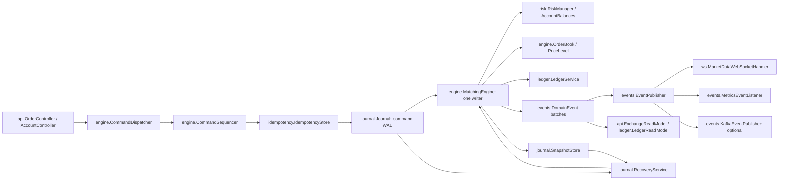

# Matchforge architecture

Session 1 delivers domain values, validated configuration, the local journal, schema,
and build/test infrastructure. The engine, HTTP API, durable adapter, publishers,
and recovery described below are the implementation plan for subsequent sessions.

## Boundaries and concurrency

All packages live under `io.github.guilhermebars.matchforge`. `domain`, `engine`,
`risk`, `ledger` core and `idempotency` core have no Spring dependency.
`MatchforgeApplication`, `config.MatchforgeProperties` and adapter configurations
own framework wiring. REST DTOs do not enter the engine directly.

`CommandDispatcher` owns a bounded queue and one executor thread, with one
`CompletableFuture<CommandResult>` per submitted command. `CommandSequencer`
assigns sequence, timestamp and deterministic identifiers before persistence.
`MatchingEngine.process(CommandEnvelope)` receives sealed command records
`PlaceOrder`, `CancelOrder`, `ReplaceOrder`, `CreateAccount`, `Deposit`, and
`Withdraw`. It returns an immutable `CommandResult` and ordered `DomainEvent`
batch; it never reads a clock, generates random IDs or performs I/O.

`OrderBook` stores bids descending and asks ascending in `TreeMap<Long, PriceLevel>`.
`PriceLevel` uses intrusive doubly linked `RestingOrder` nodes for FIFO matching;
an `OrderId` index points directly to nodes for O(1) removal (removing an empty
price level still costs O(log levels)). `ReplaceOrder` keeps priority for a
quantity decrease at the same price; a price change or increase loses priority.
IOC and market remainders expire. FOK preflights liquidity, risk and self-trade
constraints before any mutation. Self-trade policy is **reject newest**: preflight
rejects the entire incoming command if its executable path would hit its own
resting order, preventing partial side effects before rejection.

Reads use atomically published immutable `ExchangeReadModel` views, or queue a
read on the engine thread. They never traverse mutable books from HTTP threads.
The single writer simplifies deterministic replay and cross-asset settlement but
limits throughput to one core. Symbol sharding is a roadmap item requiring a
coordinated account reservation design. Shutdown stops admission, drains accepted
commands, then closes publishers, the executor and database resources.

## Fixed point and risk

`Price(long units, int scale)` and `Quantity(long units, int scale)` accept scales
0..18, parse unsigned plain decimal strings exactly, and format without exponents.
Scale is part of identity; arithmetic/comparison requires canonical scales.
Zero represents empty balances/remainders; `InstrumentConfig` rejects zero order
price/quantity and enforces exact tick/lot multiples and configured scales.
Identifiers preserve case and reject whitespace. Assets/symbols are uppercase;
account, order and client order IDs allow 1..128 ASCII identifier characters.

`Price.multiply(Quantity, resultScale)` uses `Math.multiplyExact` before exact
rescaling; overflow (even an intermediate product) and fractional output atoms
are rejected, never silently rounded. The current instruments use price scale 2
and quantity scale 8. Planned `AssetPrecisionRegistry` uses base scale 8 and USD
settlement scale 10, so one tick times one lot is representable. A shared asset
must have one settlement scale across all markets; startup wiring must enforce
that invariant before adding new markets. Bounds checks precede state mutation.

`AccountBalances` owns available/reserved amounts per `(AccountId, Asset)`.
`RiskManager` checks known instruments, positive tick/lot-compliant sizes and
sufficient funds. Buy limits reserve limit price times quantity in quote atoms;
sells reserve base quantity. Market buys require an explicit positive quote
budget, and stop before exceeding it. On fills, reservations settle to the
counterparty; buy price improvement is released immediately. Cancel/expiry
releases the remaining reservation. Replace preflights its complete reservation
delta before modifying the existing order. Fees default to zero; later fee
support must include fees in reservations and credit a `FEES` house account.

## WAL, snapshots and recovery

`Journal` currently has a volatile `InMemoryJournal`; `PostgresJournal` will
implement the same contiguous sequence contract with committed inserts into
`journal_entry(seq, type, payload, created_at)`. Payloads are versioned command
envelopes containing all replay inputs; event envelopes may be stored too, but
recovery applies commands once, never both commands and their derived events.
If event entries use journal sequences, their ordering must be deterministic and
snapshots must always end on a fully completed command/event batch boundary.

The writer checks idempotency, then commits the command WAL, processes the engine,
records its result, updates read models and acknowledges the request. A WAL failure
has no engine effects. An unexpected failure after commit fences the writer:
stop admission and recover before continuing. Business rejections are deterministic
results and are replayable. A crash after commit but before response replays the
command and returns its original result on retry.

`SnapshotCoordinator` schedules a snapshot every `matchforge.snapshot.interval`
commands and handles the future admin endpoint. `SnapshotStore` will have
`InMemorySnapshotStore` and `PostgresSnapshotStore` implementations. Snapshots are
versioned immutable copies captured at an engine command boundary, containing
books/FIFO order, balances/reservations, IDs, sequence, idempotency results,
instrument precision/configuration fingerprint and required read-model state.
Persist only completed snapshots to `snapshot(seq, payload, created_at)`.
`RecoveryService` loads the latest compatible snapshot, replays later commands
without external publication, rebuilds projections and then opens admission.
Malformed/unsupported persisted versions fail startup rather than skip data.
Postgres operation assumes one active writer instance; a database advisory lock
will enforce this. No journal pruning is planned until recovery is proven.

## Idempotency, settlement and delivery

`IdempotencyStore` keys placement by `(AccountId, ClientOrderId)`, stores a canonical
command fingerprint and the original `CommandResult`. Identical retries return
that result; a different payload yields HTTP 409. Lookup and insertion occur on
the writer. Journal replay and snapshots restore results, including rejections;
transport timeouts must not cause a second order.

`LedgerService` creates immutable signed `LedgerPosting` records: debit buyer
quote / credit seller quote, debit seller base / credit buyer base. Each trade's
postings sum to zero per asset. Deposits and withdrawals use an external clearing
account so all ledger transactions balance; customer plus house balances equal
net external funding. `LedgerReadModel` persists postings transactionally with
unique `(journal_seq, posting_index)` keys for replay-safe updates. The V1 table
is a rebuildable projection; cross-row balancing is enforced by the service,
not falsely claimed as a row-level SQL constraint.

`InProcessEventPublisher` fans out immutable sequenced batches to WebSocket and
metrics listeners. `/ws/market-data` accepts book/trade subscriptions and publishes
aggregated top-N depth and trade prints with sequence numbers. Slow subscribers
use bounded queues and disconnect/resubscribe on gaps; they never block matching.
`KafkaEventPublisher` is conditional on `matchforge.events.publisher=kafka`, topic
`matchforge.events`. Producers are not started in the default in-process mode.
Future durable delivery needs a journal cursor/outbox and stable event IDs:
delivery is at least once with consumer deduplication, never claimed exactly once.
Publisher failures cannot roll back committed trades. Metrics include accepted/
rejected orders, trades, cancels, command/journal latency, book depth and sequence.

## Configuration, verification and limitations

Default configuration targets PostgreSQL on localhost:5432; `DB_URL`,
`DB_USERNAME`, `DB_PASSWORD`, `JOURNAL_TYPE`, `EVENTS_PUBLISHER` and
`SNAPSHOT_INTERVAL` override the defaults. `--spring.profiles.active=memory`
excludes DataSource and Flyway autoconfiguration and wires `InMemoryJournal`.
`local` includes `memory`; neither requires Docker. All local state is lost on exit.
Setting only `JOURNAL_TYPE=memory` does not disable database autoconfiguration;
use the profile for database-free startup. Port is 8080.

Run `./gradlew --no-daemon build` (`.\gradlew.bat --no-daemon build` on Windows).
Java 21 must already exist; toolchain auto-download is disabled. JUnit Jupiter and
jqwik both run, and test finalizes XML/HTML JaCoCo reporting. JMH sources belong
in `src/jmh/java`; no engine performance results exist yet. Later integration
tests must use `@Testcontainers(disabledWithoutDocker = true)` locally and run
with Docker in CI. Later sessions will prove price-time priority, risk/ledger
invariants, FOK atomicity, idempotency, restart replay, REST and WebSocket flows.

Authentication is out of scope: requests will carry account IDs, so the planned
API must not be exposed as a production exchange. This scaffold does not yet
implement matching, the API, Postgres journal/recovery, snapshots or publication.
